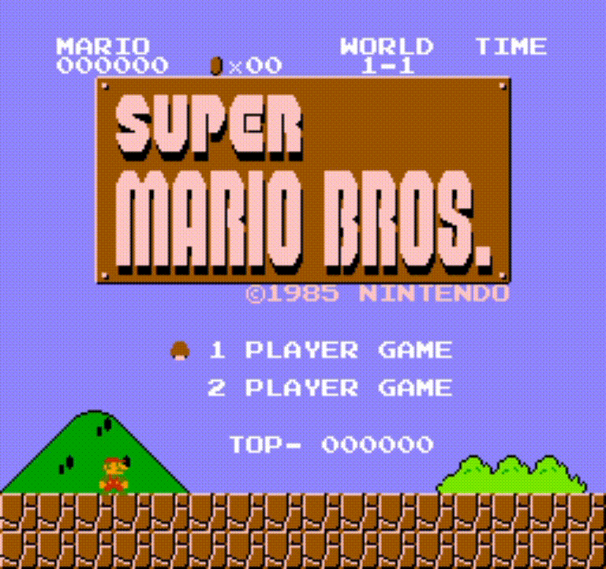

# nesemu (A NES Emulator in Silicon)

An experimental Nintendo Entertainment System emulator written entirely in [**Silicon**](https://github.com/ThatOneDamien/siliconc), a programming language currently under development by me.

This project serves two purposes:

1. Build a functional NES emulator
2. Stress-test and evolve the Silicon language through a real systems-level application

The emulator is being developed from scratch with a focus on:
- low-level control
- explicit memory behavior
- clean architecture
- performance-oriented design
- emulator accuracy over shortcuts

## Demo



## How to Build
Currently the emulator is only available on linux, as the siliconc compiler is also only written for linux at the 
moment, though I plan for that to change in the near future.

### 1. Install Required Packages
To build sic and run the emulator, you will need the following packages. Translate to your distribution as needed.

Arch Linux:
```bash
> sudo pacman -S sdl3 llvm llvm-libs pkgconf
```

### 2. Clone and Build sic
```bash
> git clone https://github.com/ThatOneDamien/siliconc
> cd siliconc
> make debug
```

You will then be able to enter the build directory and see the the sicdb executable.

### 3. Move the sicdb Executable to the Emulator Directory
Go to the build location of sic, and move the exectable to the root directory of the emulator.

### 4. Make the Emulator
Simply run:
```bash
> make
```
and if set up correctly, you will be presented with the executable in the build folder.

### 5. Run the Emulator!
The emulator currently only accepts one argument and unfortunately has no user interface for save states or
keybind customization (coming in the future!). You can call the emulator with the iNES ROM as the second argument.
```bash
> build/nesemu 'Super Mario Bros. (USA).nes'
```

| Button     | Keybind
|------------|----------
| A          | X
| B          | Z
| Up         | UpArrow
| Down       | DownArrow
| Left       | LeftArrow
| Right      | RightArrow
| Start      | Enter
| Select     | RShift


## About Silicon

Silicon is a custom programming language designed for systems programming and compiler experimentation.

Current goals of the language include:
- predictable performance
- manual control where it matters
- modern syntax without excessive abstraction
- straightforward interoperability with low-level concepts
- strong compile-time foundations

This emulator acts as a large-scale real-world testbed for the language runtime, compiler, type system, memory model, and tooling.

## Current Progress

- [x] 6502 CPU core
- [x] Instruction decoding
- [x] Addressing modes
- [x] NES memory bus
- [x] iNES ROM loading
- [x] Mapper 0 (NROM)
- [x] PPU implementation
- [x] Controller input
- [ ] APU/audio
- [ ] More mappers (MMC1, MMC3)
- [ ] Save states
- [ ] Debugger / disassembler
- [ ] Cycle accuracy improvements

## Project Goals

This is not intended to be just another emulator implementation.

The larger goal is to explore:
- systems language ergonomics
- compiler/codegen quality
- emulator architecture
- low-level debugging workflows
- performance profiling
- memory-safe abstractions without sacrificing control